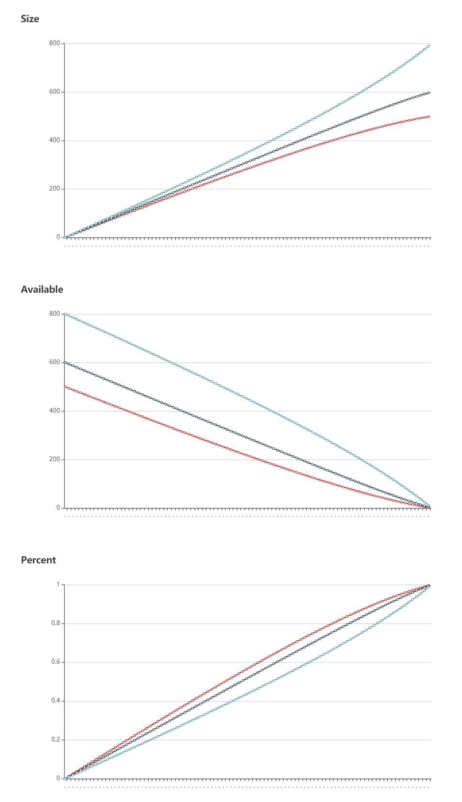

# region-score-simulator

A tool to test the scheduling result of the PD region scoring formula under different cluster sizes.

The current formula is:


- R = total region size
- C = store capacity size
- A = store available size

## Usage

```
go run main.go
```

Then access `http://127.0.0.1:8081` in browser.

### Screenshot



## configuration

Use URI query parameters to change config. Supported parameters:

* stores

Sizes of TiKV nodes (unit: GiB), joined with `_`. Example: `stores=200_300_500`. Default value is `500_600_800`.

* k

K in the formula. Example: `k=2.1`. Default value is `1`.

* m

M in the formula. Example: `m=512`. Default value is `256`.

To specify multiple parameters:

```
http://127.0.0.1:8081?stores=200_300_500&k=2.1&m=512
```


